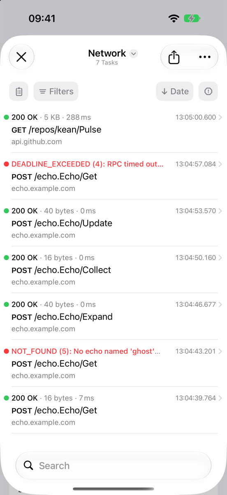
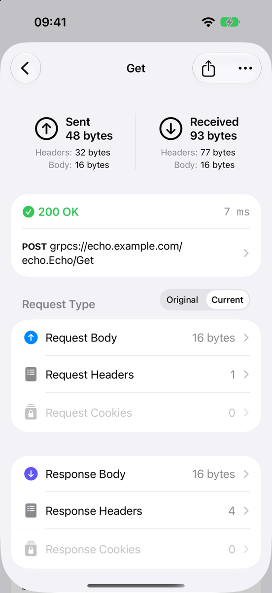

# PulseGRPC

Log [grpc-swift](https://github.com/grpc/grpc-swift-2) v2 client calls to [Pulse](https://github.com/kean/Pulse), next to your URLSession traffic.

<p align="center">
  
  
</p>

`PulseClientInterceptor` records each RPC attempt as a Pulse network task:

- a `grpcs://host/package.Service/Method` URL and the `grpc` label,
- request and response messages as JSON bodies,
- metadata as headers, plus `grpc-status` and `grpc-message`,
- the duration, transfer sizes and a timing chart,
- a failure state when the status isn't OK.

The tasks work with everything in Pulse: the console, search, filters, redaction, sharing, remote logging and Pulse Pro. Pulse's store doesn't change.

## Status

PulseGRPC needs two `NetworkLogger` methods that aren't in a Pulse release yet. They are proposed upstream, together with a few fixes this package relies on. Until a release includes them, take Pulse from the fork branch shown in [Installation](#installation).

## Requirements

- iOS 18, macOS 15, tvOS 18, watchOS 11, visionOS 2, which are grpc-swift v2's minimums
- Xcode 26 (Swift 6.2) or later
- grpc-swift-2 2.4.2 or later, tested with 2.4.3
- Pulse with `NetworkLogger.logTaskCreated(taskId:…)` and `logTaskCompleted(taskId:…)`

## Installation

```swift
dependencies: [
    .package(url: "https://github.com/ffittschen/PulseGRPC.git", branch: "main"),
    // Take Pulse from the same fork branch as PulseGRPC. SwiftPM treats kean/Pulse and the
    // fork as one package, so a version requirement on kean/Pulse next to it won't resolve.
    .package(url: "https://github.com/ffittschen/Pulse.git", branch: "integration/pulse-grpc"),
],
targets: [
    .target(name: "App", dependencies: [
        .product(name: "PulseGRPC", package: "PulseGRPC"),
        .product(name: "PulseUI", package: "Pulse"),
    ]),
]
```

## Usage

Add the interceptor **last**:

```swift
import GRPCCore
import PulseGRPC

let client = GRPCClient(
    transport: transport,
    interceptors: [
        AuthInterceptor(),
        PulseClientInterceptor(baseURL: URL(string: "https://api.example.com")),
    ]
)
```

- grpc-swift runs interceptors in array order, and the last one is closest to the transport. There, the Pulse interceptor sees the final metadata (e.g. an `authorization` header added by an earlier interceptor) and the raw `RPCError` before other interceptors rewrite it.
- It runs once per attempt, so retries and hedged attempts show up as separate tasks.

Show the console with PulseUI:

```swift
import PulseUI

.sheet(isPresented: $isConsolePresented) {
    NavigationStack { ConsoleView() }
}

// Pushed onto your own navigation stack, which already has a back button:
NavigationLink("Network") { ConsoleView().closeButtonHidden() }
```

To see only gRPC calls, filter by "URL begins with grpc", or by the `grpc` label in Logs mode.

### Parameters

| Parameter | Default | Description |
|---|---|---|
| `baseURL` | `nil` | The server URL, used for the logged URL. `https` and `grpcs` become `grpcs://`; anything else becomes `grpc://`. The path is kept; the query and fragment are dropped. `nil` uses the remote peer's address with `grpc://`. |
| `logger` | `nil` | The `NetworkLogger`. `nil` uses `NetworkLogger.shared`, looked up on every call. |
| `label` | `"grpc"` | The task label. `nil` uses the logger's configured label. |
| `jsonEncodingOptions` | `.init()` | SwiftProtobuf's `JSONEncodingOptions` for the bodies. |

## What gets logged

| Pulse field | Value |
|---|---|
| URL | `{grpc,grpcs}://{host}[:{port}]{basePath}/{package.Service}/{Method}` |
| Method | `POST` |
| Request headers | Request metadata, with lowercase keys as HTTP/2 sends them. Repeated keys are joined with `", "`, binary values are base64-encoded, and `Content-Type: application/json` is added. |
| Request body | The request messages as JSON. Two or more messages become a JSON array. |
| Response | Status `200`, HTTP/2, headers from initial and trailing metadata plus `grpc-status` and `grpc-message` |
| Response body | The response messages as JSON |
| Error | For a non-OK status, an `NSError` in the `gRPC` domain whose description reads e.g. `NOT_FOUND (5): user not found` |
| Metrics | The duration, and one transaction with the JSON body sizes, estimated header sizes, the request/response timing and the peer address |

A task is pending until the call ends. A client-streaming or bidi request body only appears once the call has finished.

## Redaction

Configure Pulse's `NetworkLogger` as usual:

```swift
NetworkLogger.shared = NetworkLogger {
    $0.sensitiveHeaders = ["authorization"]
    $0.sensitiveDataFields = ["accessToken", "password"]
}
```

- `sensitiveHeaders` matches metadata keys case-insensitively. This needs the Pulse fix proposed upstream.
- `sensitiveDataFields` matches JSON keys as they're encoded: lowerCamelCase by default, or the proto field names if you set `preserveProtoFieldNames`. It works inside objects and arrays, but not on a message that encodes to a bare JSON value, such as `Google_Protobuf_StringValue`. Redaction re-serializes the JSON, so key order can change.
- Pulse's include/exclude filters and `willHandleEvent` apply as they do for URLSession tasks.

## Example app

`Examples/PulseGRPCExample.swiftpm` is an iOS app package; open it in Xcode and run it on an iOS 18 or later simulator. It talks to an in-process Echo server, so the gRPC calls need no network, and it makes every kind of RPC, including a failing call and a deadline. One REST call shows the two side by side.

## Known limitations

- **Connection failures aren't logged.** DNS, TLS and connection-refused errors happen before interceptors run.
- **The HTTP status is always 200**, because the interceptor never sees HTTP.
- **Headers added by the transport aren't visible**, e.g. `:authority`, `user-agent`, `content-type` and `te`.
- **Deadlines are inferred** from `grpc-timeout` and cancellation, with a 20 ms tolerance. grpc-swift computes `grpc-timeout` before it connects, so when connecting takes longer than that, a deadline on a new connection can show as `CANCELLED`. The message says how much time was allowed and how much had passed.
- **Default-valued fields are missing from bodies**, because proto3 JSON omits them.
- **A one-message server stream looks like a unary call:** a single object, not an array.
- **Sizes are JSON sizes**, not wire sizes, and header sizes are estimates. Compression isn't visible.
- **Long streams stay pending until they end**, and their messages are buffered in memory until then.
- **Failed calls show a short status** in the console list, and the full description in the inspector.

## Development

```sh
swift test
Scripts/generate-test-protos.sh   # regenerates the Echo fixtures; needs protoc
```

`Package.resolved` pins swift-collections to 1.3.0. Built with Xcode 27, swift-collections 1.7 references `_swift_initBorrow`, which macOS 26 and iOS 26 don't have, so test bundles and apps fail to load there. The example app's `Package.resolved` has the same pin.

## License

MIT, see [LICENSE](LICENSE). Pulse is MIT-licensed by Alexander Grebenyuk.
